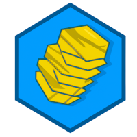

    

<h1 align="center">Rotini</h1>

## Overview

**Rotini** is a self-hosted cloud storage application that gives you full-control over the data you store. It aims
for simplicity and extensibility, such that you can get started in minutes and easily fork or contribute upstream if you
fancy a feature that's not already there.

It's roadmap is currently TBD and will become better defined as it gets closer to a first release.

## Development

### Tooling

Utility commands are managed by [go-task](https://github.com/go-task/task) and can be called from anywhere. Running `.
script/bootstrap` in the project root installs `go-task` within the project and gets everything ready. From there, `task -l` provides a
breakdown of available tools.

Note that this is the preferred way to running any tooling-related task within the repository, regardless of
environment. Individual scripts exist under `/{frontend,backend}/script` but generally assume that they will be called
through `task` to inject some environment variables.

The project uses [Podman](https://podman.io/) as a default container manager, but is Docker-compatible
(`Taskfile.backend.yml` can be made to specify `CONTAINER_MANAGER="docker"` to use it).

#### Formatting

Formatting in either frontend or backend environment can be done via `task {fe,be}:lint`. Applying fixes is available
through the `lintfix` variant of the command.

#### Running tests

Test suites can be executed by environment via `task {fe,be}:test`.

### Running locally

The application requires a Postgres database instance to be made available to the backend. Setting up a local database
is handled by the backend start command.

Starting the backend (including a database) and frontend applications can be done via `task be:container:start` and `task fe:start`.

See the README files of each of those environments ([backend](./backend/README.md), [frontend](./frontend/README.md)) for specific requirements around `*.env` files that aren't committed with the code.

## Production-ready deployments

_Coming soon!_
